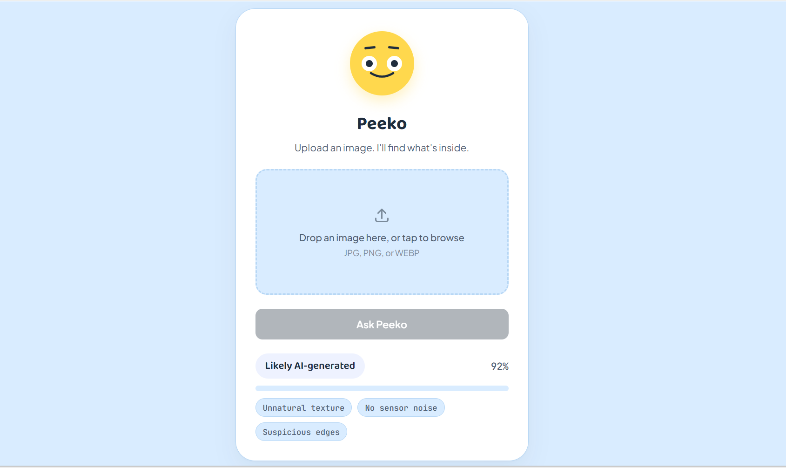
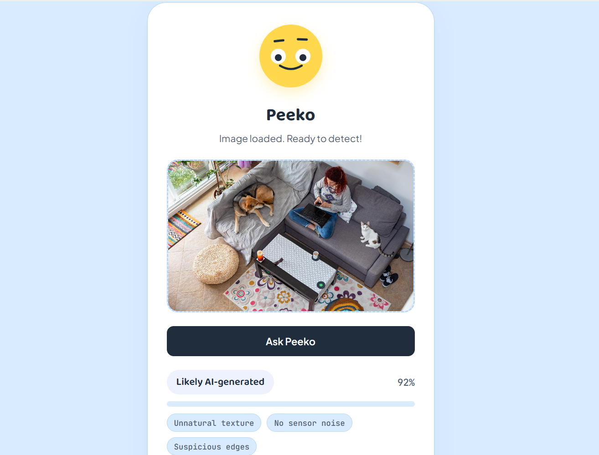
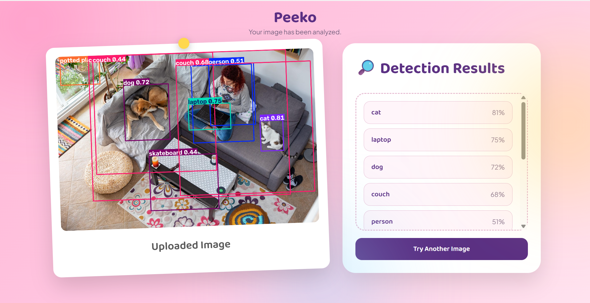
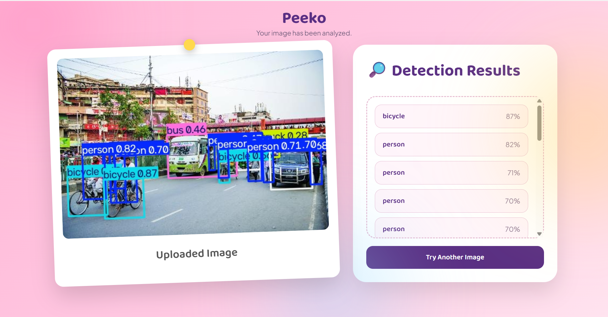

# 🐾 Peeko

Peeko is an AI-powered image detection web app. Upload a photo, and Peeko runs object detection on it using a pretrained YOLOv8 model, then shows you the result with bounding boxes drawn around detected objects.

## Features

- 📤 Simple drag-and-drop / file upload interface
- 🔍 Real-time object detection powered by YOLOv8 (Ultralytics)
- 🖼️ Annotated result image with bounding boxes
- 🎬 Fun mascot scan animation while detection runs
- ⚡ Fast inference backend built with FastAPI

## Tech Stack

- **Backend:** FastAPI
- **Detection Model:** YOLOv8 (Ultralytics, pretrained)
- **Image Processing:** OpenCV
- **Frontend:** HTML, CSS, JavaScript

## Project Structure

```
peeko/
├── main.py                 # FastAPI app entry point
├── requirements.txt        # Python dependencies
├── static/
│   ├── style.css
│   ├── dashboard.css
│   ├── script.js
│   ├── result.css
│   ├── results/            # Annotated output images
│   └── uploads/            # User-uploaded images
└── templates/
    ├── index.html          # Upload page
    └── result.html          # Detection result page
```
## 📸 Project Screenshots

### 1️⃣ User Interface
The homepage where users can upload an image for AI analysis.



---

### 2️⃣ Processing Image
The application processes the uploaded image before sending it to the AI model.



---

### 3️⃣ Detection Results
The AI displays the detected objects along with confidence scores.



---

### 4️⃣ Image Analysis
A detailed analysis of the uploaded image is presented to the user.



## How It Works

1. User uploads an image on the home page.
2. A scan animation plays while the image is sent to the backend.
3. The FastAPI backend runs YOLOv8 inference on the image.
4. OpenCV draws bounding boxes around detected objects and saves the annotated image.
5. The result page displays the annotated image with detection results.

## Getting Started

### Prerequisites

- Python 3.9+
- pip

### Installation

```bash
git clone https://github.com/<your-username>/peeko.git
cd peeko
pip install -r requirements.txt
```

### Run the app

```bash
uvicorn main:app --reload
```

Then open `http://127.0.0.1:8000` in your browser.

## Roadmap

- [ ] Support multiple object classes / custom-trained models
- [ ] Add detection confidence threshold control
- [ ] Deploy to a live hosting platform
- [ ] Add history of past uploads/detections

## Author

Built by [Your Name] as part of an AI engineering portfolio.

## License

MIT
